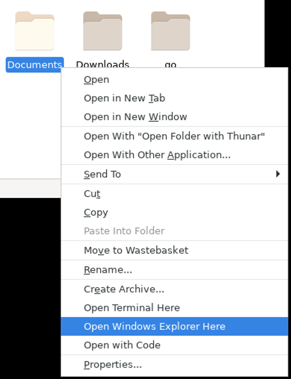
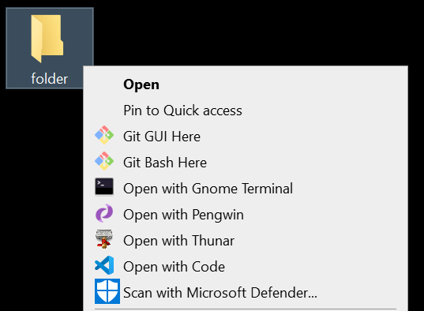

# wsl2
Notes on setup of Windows Subsystem for Linux (version 2)

Notes in this repository mainly describe the setup of pengwin version 1.3.4 in WSL2

# Disclaimer

We write these notes for personal use.  Please use at your own risk.

# Use Latest Network Drivers

In our testings, micrsoft "Windows Update" app does not detect newer version of wifi driver on one of our devices.  The old driver did cause an issue under WSL2 [e.g. <a href="https://github.com/microsoft/WSL/issues/4253">a link here</a>, <a href="https://github.com/WhitewaterFoundry/Pengwin/issues/561">another link here</a>].

If you use Intel hardware, to make sure you get the latest drivers, go to the following link and install "Intel Driver & Support Assistant":

https://www.intel.com/content/www/us/en/support/intel-driver-support-assistant.html

Do a scan with the assistant and install the latest network drivers if newer versions are found.

# Notes on enabling WSL

https://docs.microsoft.com/en-us/windows/wsl/install-win10

# Notes on conversion between WSL1 & WSL2

https://www.pengwin.dev/blog/2019/6/12/enable-wsl2-and-convert-existing-pengwin-installations

# Setup X410 (PAID)

DPI Scaling > High Quality (Windowed Apps Only)

Shared Clipboard > Enable

Miscellaneous Options > Capture Windows Key

To work with WSL2, select "Allow Public Access"

Remarks: Set Windows firewall according to your needs.

# Alternative to X410 - VCXSRV (FREE)

You may consider VCXSRV as an alternative to X410.

We do not recommended installing VCXSRV via pengwin-setup.

Instead, we recommend installing VCXSRV via Windows PowerShell (Admin):
[Reason: It is easier to use XLaunch from start menu for configuration.]

> choco install vcxsrv

To make "vcxsrv" to work with google web engine or QtWebEngine, select from XLaunch "Native OpenGL".

To make "vcxsrv" to work with WSL2, select from XLaunch "Disable Access Control".

<b>Comment:</b>

In our testing, windowed apps work better and look nicer in X410, as it offers a feature "DPI Scaling > High Qaulity".  You don't need to install VCXSRV if you have X410 installed.

# Autostart Display Server

It is better to start display server before launching a GUI app.  To start a display server automatically, for example, X410

Open Windows "Run" app, 

to open apps folder

> shell:appsfolder

to open startup folder

> shell:startup

To create link in startup, drag X410 from apps folder to startup folder

# Update Installed Packages

> sudo apt update 
> sudo apt dist-upgrade

# Edit 00-pengwin.sh

> sudo nano /etc/profile.d/00-pengwin.sh

Change from:

> alias ll='ls -al'

To:

> alias ll='ls -alh'

# Setup with pengwin-setup

<b>RECOMMENDED:</b>

GUI > GUILIB

GUI > SYNAPTIC

PROGRAMMING > GO

PROGRAMMING > PYTHONPI

SETTINGS > EXPLORER

SETTINGS > COLORTOOL

<b>NOT RECOMMENDED:</b>

GUI > FCITX [It breaks in many GUI apps under WSL2]

GUI > HIDPI [instead, use X410 > DPI Scaling > High Quality (Windowed Apps Only)]

EDITORS > CODE [read: https://github.com/eliranwong/wsl2/blob/master/programming/vs_code.md]

# Settings for Launching Linux GUI Apps

There were mutliple issues about running GUI apps with pengwin version earlier than 1.3.4 under WSL2.  Most know issues had been fixed with pengwin version 1.3.4.

Two suggestions here:

1) Add the following line to "~/.profile", if you need to work with .Xresources, e.g. https://github.com/eliranwong/wsl2/blob/master/terminal/urxvt.md#to-customise:

> xrdb -merge ~/.Xresources

2) To assign QStandardPaths for running Qt applications, app the following lines to file "~/.profile":

> mkdir -p /tmp/runtime-$USER 
> chmod 7700 /tmp/runtime-$USER 
> export XDG_RUNTIME_DIR=/tmp/runtime-$USER

# Setup Common Tools

> sudo apt install apt-utils build-essential cmake tree wget curl git zip unzip xz-utils nano lib32stdc++6 sqlite3 libsqlite3-dev libasound2 libnss3 libncurses5 libncurses5-dev libgl1-mesa-dev mesa-utils lsb-release binutils dbus-x11 youtube-dl ffmpeg gawk translate-shell opencc rar unrar mlocate

# Examples on Command-line Tools

* Useful tools

https://github.com/eliranwong/wsl2/blob/master/cli_tools/Readme.md

* Download Youtube Video / Audio

https://github.com/eliranwong/wsl2/blob/master/multimedia/youtube-dl.md

* video conversion:

https://github.com/eliranwong/wsl2/blob/master/multimedia/ffmpeg.md

# Setup Input Method

"fcitx", bundled with pengwin, is not working in WSL2 at the time of writing.

We recommend "ibus" instead.  For setup of ibus, read:

https://github.com/eliranwong/wsl2/blob/master/input_method/ibus.md

# Setup Terminal Apps

For issues with official pengwin terminal window and alternatives, you may read:

https://github.com/eliranwong/wsl2/blob/master/terminal/Readme.md

# Setup Linux GUI File Manager

https://github.com/eliranwong/wsl2/blob/master/file_manager/thunar.md

# Open a File on WSL with Default Windows Application

For example to open a file, say "my_word_document.docx", located on WSL, with Microsoft Word installed on Windows:

> powershell.exe start "my_word_document.doc"

* To create an alias:

> echo "alias start='powershell.exe start'" >> ~/.bashrc

* To create a custom action in Thunar:

Name & Description: 
> Open with Default Windows Application

Command: 
> powershell.exe start "%n"

Appearance Conditions: 
> Text Files, Audio Files, Video Files, Image Files, Other Files

For more about Thunar: https://github.com/eliranwong/wsl2/blob/master/file_manager/thunar.md

# Open Windows Explorer via Linux Shell

> explorer.exe .

# Open Windows Explorer via Thunar File Manager

https://github.com/eliranwong/wsl2/blob/master/file_manager/thunar.md#open-a-folder-with-windows-explorer

# Launch Thunar File Manager from Windows Explorer

https://github.com/eliranwong/wsl2/blob/master/file_manager/thunar.md#launch-thunar-from-windows-context-menu

# Lanuch Gnome Terminal from Windows Explorer

https://github.com/eliranwong/wsl2/blob/master/terminal/gnome-terminal.md

# Launch Windows Linux Shell from Windows Explorer

On Windows Explorer,

Enter "wsl" on address bar 
<i>or</i> 
right-click and select "Open with Pengwin" 
<i>or</i> 
shift & right-click and select "Open with Pengwin" 
<i>or</i> 
shift & right-click and select "Open Linux shell here"

# WSL Utilities 

<a href='https://github.com/wslutilities/wslu'>WSL Utilities</a> are bundled with pengwin.  Read more about these utilities at https://github.com/wslutilities/wslu.

For example, to open a website, say https://github.com, using Windows default web browser, run

> wslview https://github.com

* <b>To WSL2 Users</b>, wslusc, bundled with pengwin version 1.3.4 does not work with WSL2.

Use /usr/local/pengwin-setup.d/generate-shortcut.sh instead.  For example: https://github.com/eliranwong/wsl2/blob/master/bible_apps/desktop.md#create-a-windows-shortcut-recommended-for-pengwin-version-134

Alternatively, you can create a Windows shrotcut directly with Windows GUI.  For example: https://github.com/eliranwong/wsl2/blob/master/bible_apps/desktop.md#create-a-windows-shortcut-directly-on-windows

# Setup Bible Apps

Command line version of UniqueBible.app:

https://github.com/eliranwong/wsl2/blob/master/bible_apps/command_line.md

Desktop version of UniqueBible.app:

https://github.com/eliranwong/wsl2/blob/master/bible_apps/desktop.md

# Setup Other GUI Apps

To install available packages:

> sudo apt install gedit geany geany-plugins rxvt-unicode gnome-terminal thunar thunar-archive-plugin thunar-media-tags-plugin sqlitebrowser firefox-esr flashplugin-nonfree falkon gnome-keyring libsecret* libreoffice gthumb gimp

[Remarks: ibus works with all the above GUI apps tested in both WSL1 & WSL2 whereas fcitx works only in some applications in WSL1.  At the time of writing, fcitx is broken in WSL2.] 
[Remarks: Some of GUI apps above, e.g. falkon, work only in version 2 of WSL.] 
[Remarks: gnome-keyring & libsecret* are required for running mailspring.]

* Office 
wps office [https://www.wps.com/download] shows better compatibilities with ms files than libreoffice.  You can also open an office file located on WSL with Microsoft Office installed on Windows.  Read: https://github.com/eliranwong/wsl2#open-a-file-on-wsl-with-default-windows-application

* mail client 
mailspring is available for download at https://getmailspring.com/. Mailspring works with gmail signin whereas thunderbird doesn't.
To verify gmail signin with mailspring, use Linux browser installed in WSL2 instead of using browser installed in Windows directory. Use Firefox / Chrome / Opera instead of falkon for gmail signin verification.

* Web browser 
In our testings, chrome and opera browsers work in WSL2, but not in WSL1 
Chrome is available at: https://www.google.com/chrome/ 
Opera is available at: https://www.opera.com/ 
Chrome works the best with signin of mutliple gmail accounts.

# GUI for pacakage management

> sudo synaptic

# Fixing Windows Startmenu Shortcuts

For issues before pengwin version 1.3.4, you may read https://github.com/WhitewaterFoundry/Pengwin/issues/551.  Issues mentioned in the post had been fixed in pengwin version 1.3.4.

After installing multiple gui apps, run:

> pengwin-setup

select GUI > STARTMENU

The problem with creating shortcuts with pengwin-setup is that existing shortcuts are created again each time you run pengwin-setup > GUI > STARTMENU.  For examples, after installing 10 gui apps and run pengwin-setup > GUI > STARTMENU.  When you install one more gui app, running pengwin-setup > GUI > STARTMENU is ineffective because it creates shortcuts for all 11 gui apps.

A workaround is to use /usr/local/pengwin-setup.d/generate-shortcut.sh directly.  For example: https://github.com/eliranwong/wsl2/blob/master/bible_apps/desktop.md#create-a-windows-shortcut-recommended-for-pengwin-version-134

Alternatively, you can create a Windows shrotcut directly with Windows GUI.  For example: https://github.com/eliranwong/wsl2/blob/master/bible_apps/desktop.md#create-a-windows-shortcut-directly-on-windows

# Use Windows Fonts

We find that we don't have to to add any fonts on Linux side, as with pengwin, our tested GUI applications can use fonts installed on Windows side directly.

For examples, we have fonts "NSimSun" and "Calibri" instalaled on Windows on our device.

We assign Windows font "NSimSun" to a Linux terminal app: 
https://github.com/eliranwong/wsl2/blob/master/terminal/urxvt.md#to-customise

We assign Windows font "Calibri" to a Linux GUI app: 
https://github.com/eliranwong/wsl2/blob/master/bible_apps/desktop.md#change-default-font

To build font information cache files:

> fc-cache -f -v

To check all available fonts:

> fc-list

# Additional Fonts

To install additional fonts, e.g. ubuntu fonts:

1) Download the latest version of Ubuntu Fonts from http://font.ubuntu.com/ or run: 
> wget https://assets.ubuntu.com/v1/0cef8205-ubuntu-font-family-0.83.zip

2) Unzip font package: 
> unzip 0cef8205-ubuntu-font-family-0.83.zip

3) Create user fonts directory: 
> mkdir -p ~/.fonts

4) Copy ubuntu fonts to user fonts directory: 
> cp -r ubuntu-font-family-0.83/ ~/.fonts

5) Build fonts information cache files:
> fc-cache -f -v

# Workaround to work with USB drive in WSL2

https://github.com/eliranwong/wsl2/blob/master/accessories/usb_drive.md

# Terminate a Distro

To check the name and version of a distro

> wsl.exe -l -v

To terminate a distro, e.g.

> wsl.exe -t WLinux

> wsl.exe -t Debian

> wsl.exe -t Ubuntu

Use $WSL_DISTRO_NAME:

> wsl.exe -t $WSL_DISTRO_NAME

To create an alias, e.g.

> echo 'alias shutdown="wsl.exe -t $WSL_DISTRO_NAME"' >> ~/.bashrc

# Shutdown Everything

Immediately terminates all running distributions and the WSL 2 lightweight utility virtual machine.

> wsl.exe --shutdown

# Restart WSL Service

Run from Windows PowerShell (Admin):

> Get-Service LxssManager | Restart-Service

# Backup & Restore a WSL Distro

To backup, open Windows PowerShell and run, e.g.:

> wsl --export WLinux WLinux.tar

> wsl --export Ubuntu Ubuntu.tar

> wsl --export Debian Debian.tar

To restore, e.g.

> wsl --import WLinux C:\Users\Eliran\WLinux C:\Users\Eliran\WLinux.tar

To unregister, e.g.

> wsl --unregister WLinux
