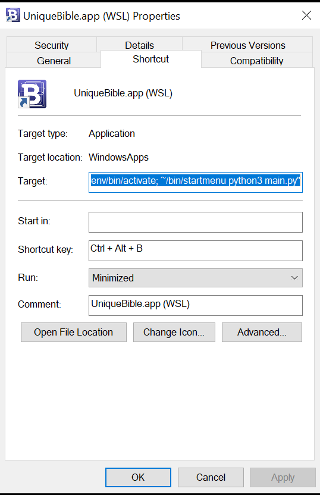

# Desktop version repository

https://github.com/eliranwong/UniqueBible

# Installation in WSL2 (Windows Subsystem for Linux Version 2)

In our testing, UniqueBible requires version 2 of WSL to work.  It does not run with version 1 of WSL.

The following example works with pengwin 1.3.4 under WSL2.

# Installation

To work with the GUI of UniqueBible.app

make sure you have "mesa-utils" installed:

> sudo apt install mesa-utils

Install "PYTHONPI" via pengwin-setup > PROGRAMMING

Alternatively, run in terminal

> sudo apt install python3 python3-setuptools python3-pip python3-venv

Download UniqueBible

> cd ~

> git clone https://github.com/eliranwong/UniqueBible

Setup virtual environment & depedencies

> cd ~/UniqueBible

> python3 -m venv venv

> pip3 install PySide2 PyPDF2 gdown python-docx

# Create an Alias

For example:

Download the following file and save to your home directory:

https://github.com/eliranwong/UniqueBible/blob/master/shortcut_uba_Windows_wsl2.sh
[Remarks: Edit ubaFolder="$HOME/UniqueBible/" on line 3 if you do not place UniqueBible folder in home directory.]

Add permission:

> chmod +x ~/shortcut_uba_Windows_wsl2.sh

Add alias:

> echo "alias uba=~/shortcut_uba_Windows_wsl2.sh" >> ~/.bashrc

# Run Alias:

> uba

# Create a Windows shortcut file [recommended]

After creating a Windows shortcut file, you can launch the app by: 
- double-clicking a shortcut file 
- using keyboard shortcuts

<b>To create a Windows shortcut file for UniqueBible.app, for example:</b>

1) Make file "main.py" executable:

> chmod +x $HOME/UniqueBible/main.py

2) Right-click an empty area on desktop

3) New > Shortcut

4) Type the location of the item, for example. 

> pengwin run "cd $HOME/UniqueBible; bash -l -c $HOME/UniqueBible/main.py"

5) Name your shortcut, e.g. "UniqueBible.app (WSL)", and select "Finish"

6) Right-click the created shortcut file, select "Properties"

7) Empty the string in "Start in"

8) In the field of "Shortcut key:", pressing "Ctrl + Alt + B" at the same time

9) Run "Minimized"

10) Download this icon https://github.com/eliranwong/UniqueBible/blob/master/htmlResources/theText.ico and assign it as the shortcut icon.

# Change default font

You can change the app's default font to your favourite font installed on your system, by editing file "config.py" with a text editor.

Find this line and change from:

> font = ''

to:

> font = 'Calibri'

You may read more about "config.py" at https://github.com/eliranwong/UniqueBible/wiki/config_file#default-font

# Shared marvelData folder in Windows Drive C [optional]

You can install a copy in Windows drive C and a copy in WSL2.

Both copies can share a single marvelData folder without duplication of storage.

In our testing, we have a copy of marvelData in Windows drive C at: 
C:\Users\elira\OneDrive\Documents\UniqueBible\marvelData

In our testing, we edited the file config.py of our LINUX copy [NOT Window copy] on line 4:

marvelData = '/home/eliran/winhome/OneDrive/Documents/UniqueBible/marvelData'

Remarks: DO NOT edit file config.py while the app is running.

Remarks: While sharing a single folder in this example may offer convenience, be aware of the issue on slower cross os file speed in current preview build of wsl2, mentioned at https://docs.microsoft.com/en-us/windows/wsl/wsl2-ux-changes#cross-os-file-speed-will-be-slower-in-initial-preview-builds .  Until the issue is fixed by microsoft wsl team, we advise using UniqueBible.app with marvelData folder located under the same os.
