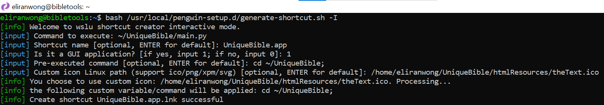

# Desktop version repository

https://github.com/eliranwong/UniqueBible

# Installation in WSL2 (Windows Subsystem for Linux Version 2)

In our testing, UniqueBible requires version 2 of WSL to work.  It does not run with version 1 of WSL.

The following example works with pengwin 1.3.4 under WSL2.

# Installation

To work with the GUI of UniqueBible.app

make sure you have "mesa-utils" installed:

> sudo apt install mesa-utils

Install "PYTHONPI" via pengwin-setup > PROGRAMMING

Alternatively, run in terminal

> sudo apt install python3 python3-setuptools python3-pip python3-venv diff_match_patch

# Download UBA

> git clone https://github.com/eliranwong/UniqueBible

# Run UBA

> python3 UniqueBible/uba.py

UBA offers automatic setup on first run.

# Create a command alias [optional]:

You can run UBA with terminal without typing a fullpath, by creating an alias.

Below is an example:

This example only works if:

1) You use bash

2) The following example assumes that you install UBA in your home directory.  You need to change the path if you install at a different location.

> echo "alias uba='$HOME/UniqueBible/uba.py'" >> ~/.bashrc

Close and reopen your terminal app, you should then be able to run UBA with this simple command:

> uba

Our setup script automatically makes file "uba.py" executable, but in case it is not running, you may need to set permission on it manually:

> chmod u+x $HOME/UniqueBible/uba.py

# Create a Windows shortcut [recommended for pengwin version 1.3.4+]

1) Make file "main.py" executable:

> chmod +x $HOME/UniqueBible/main.py

2) Run in terminal:

> bash /usr/local/pengwin-setup.d/generate-shortcut.sh -I

3) Enter the following when input is prompted:

> [input] Command to execute: ~/UniqueBible/main.py 

> [input] Shortcut name [optional, ENTER for default]: UniqueBible.app 

> [input] Is it a GUI application? [if yes, input 1; if no, input 0]: 1 
<b><i>Remarks: </i></b>: change the default 0 to 1 manually.

> [input] Pre-executed command [optional, ENTER for default]: cd ~/UniqueBible; 
<b><i>Remarks: </i></b>: Don't forget the ending ";" above.

> [input] Custom icon Linux path (support ico/png/xpm/svg) [optional, ENTER for default]: /home/eliranwong/UniqueBible/htmlResources/theText.ico 
<b><i>Remarks: </i></b>: Use literal full path for this option.  Don't use "~" or "$HOME".  Change "eliranwong" to your username.

Below is a screenshot on what it should look like:

4) Find your created shortcut file on your desktop.

5) [Optional] You can assign keyboard shortcuts, by:

* Right-click the created shortcut file, select "Properties".
* In the field of "Shortcut key:", pressing "Ctrl + Alt + B" at the same time.
* Select "OK" or "Apply" to apply the change.

# Create a Windows shortcut directly on Windows

After creating a Windows shortcut file, you can launch the app by: 
- double-clicking a shortcut file 
- using keyboard shortcuts

<b>To create a Windows shortcut file for UniqueBible.app, for example:</b>

1) Make file "main.py" executable:

> chmod +x $HOME/UniqueBible/main.py

2) Right-click an empty area on desktop

3) New > Shortcut

4) Type the location of the item, for example. 

> C:\Windows\System32\wscript.exe C:\\Users\\elira\wslu\runHidden.vbs pengwin.exe run "cd $HOME/UniqueBible; bash -l -c $HOME/UniqueBible/main.py"

<b><i>Remarks: </i></b>: Change "elira" above to your Windows username.

5) Name your shortcut, e.g. "UniqueBible.app (WSL)", and select "Finish"

6) Right-click the created shortcut file, select "Properties"

7) Empty the string in "Start in"

8) In the field of "Shortcut key:", pressing "Ctrl + Alt + B" at the same time

9) Download this icon https://github.com/eliranwong/UniqueBible/blob/master/htmlResources/theText.ico and assign it as the shortcut icon.

# Change default font

You can change the app's default font to your favourite font installed on your system, by editing file "config.py" with a text editor.

Find this line and change from:

> font = ''

to:

> font = 'Calibri'

You may read more about "config.py" at https://github.com/eliranwong/UniqueBible/wiki/config_file#default-font

# Shared marvelData folder in Windows Drive C [optional]

You can install a copy in Windows drive C and a copy in WSL2.

Both copies can share a single marvelData folder without duplication of storage.

In our testing, we have a copy of marvelData in Windows drive C at: 
C:\Users\elira\OneDrive\Documents\UniqueBible\marvelData

In our testing, we edited the file config.py of our LINUX copy [NOT Window copy] on line 4:

marvelData = '/home/eliran/winhome/OneDrive/Documents/UniqueBible/marvelData'

Remarks: DO NOT edit file config.py while the app is running.

Remarks: While sharing a single folder in this example may offer convenience, be aware of the issue on slower cross os file speed in current preview build of wsl2, mentioned at https://docs.microsoft.com/en-us/windows/wsl/wsl2-ux-changes#cross-os-file-speed-will-be-slower-in-initial-preview-builds .  Until the issue is fixed by microsoft wsl team, we advise using UniqueBible.app with marvelData folder located under the same os.
