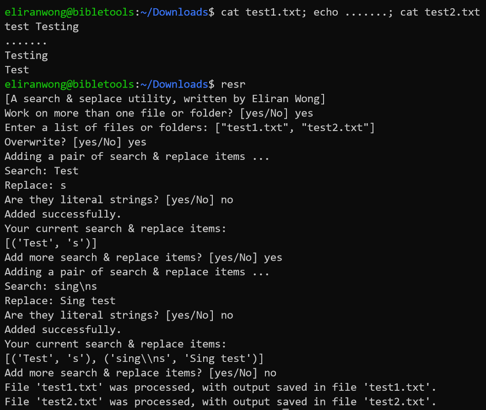
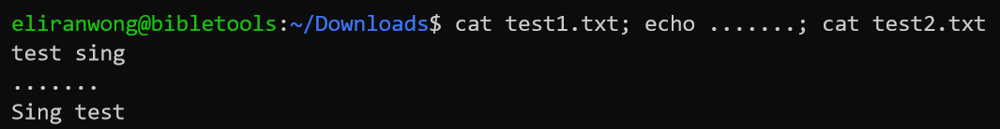
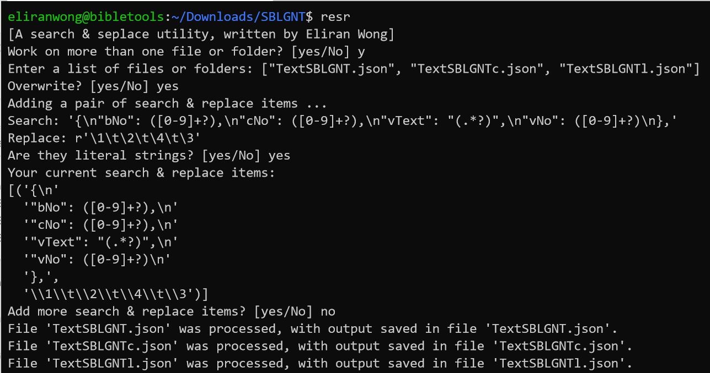
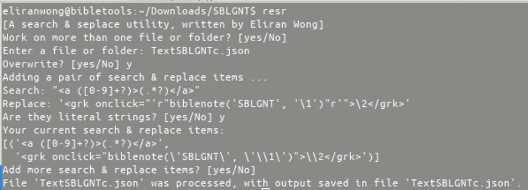
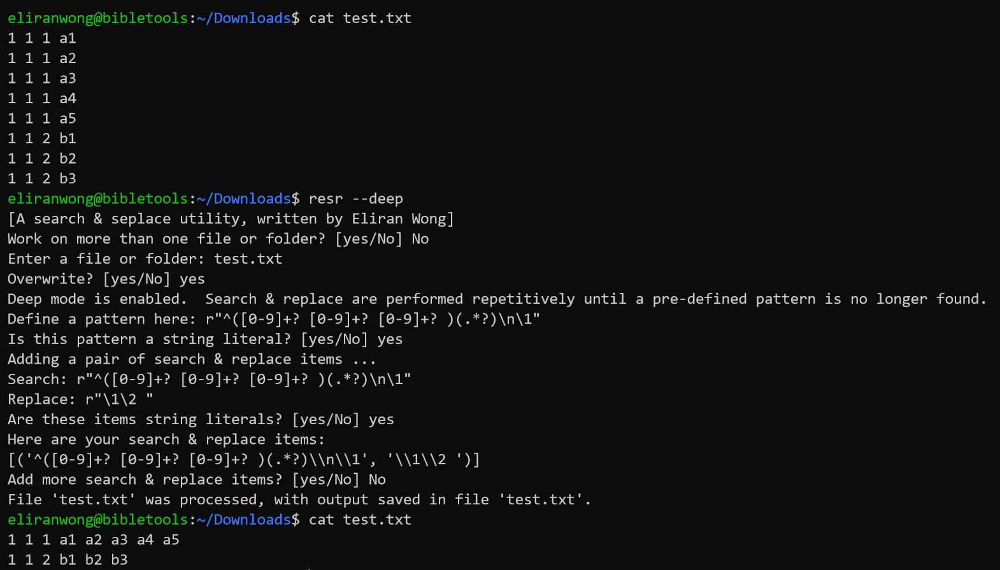

* A search and replace utility written with python:

https://github.com/eliranwong/bible-verse-parser/blob/master/RegexSearch.py

This script supports: 
* regular expression
* searching multiple lines, which "sed" does not support
* search with back references, which "awk" does not support
* option to use literal strings for search and replace
* option to overwrite the original file(s)
* work on multiple files or folders in one go
* perform multiple search and replace in one go
* two modes of searching, simple & deep, for power users
* power users can customise the script by editing function "processInputText"
* can handle large-sized file(s)
* etc.

Usage: 

RegexSearch.py [optional --deep]

OR:

RegexSearch.py [a nested tuple of search & replace items] [optional --overwrite] [file1 / folder1] [file2 / folder2] [file3 / folder3] ... 
Support multple files / folders, starting from the second parameter. 

To make this script executable, run, e.g.: 
> chmod +x RegexSearch.py 

To provide a nested tuple / list of search & replace items on command line, e.g.: 
> ./RegexSearch.py '(("test", "TEST"), ("[a-e]", r"x\\1x"))' --overwrite test1.txt test2.txt 

e.g. Convert two json files to a tab-separated text: 
> RegexSearch.py '(("{\"bNo\": ([0-9]+?), \"cNo\": ([0-9]+?), \"vNo\": ([0-9]+?), \"vText\": \"(.*?)\"},", r"\1\t\2\t\3\t\4"),)' ULT.json UST.json

To work with dynamic scripting, edit the content of function "processInputText" and run, e.g.: 
> ./RegexSearch.py '()' test.txt test1.txt 

The first parameter is optional to work on a single file or a single folder.  This assumes power users edit the content of function "processInputText" according to their own needs, e.g.: 
> ./RegexSearch.py test.txt 

To run with interactive mode, simple run: 
> ./RegexSearch.py

# Interactive mode

Below are some examples of "interactive mode":

In the following examples, we copy the scrip and put in folder "~/bin":

> cp RegexSearch.py ~/bin/resr 
> chmod +x ~/bin/resr

# Example: Simple search & replace:

# Examples - Use String Literals

* Use string literals to search multiple lines and replace with back references:

* Another example of using string literals:

# Example: Enable Deep Mode

* To use as an import to build others, for example: 
https://github.com/eliranwong/bible-verse-parser/blob/master/BibleVerseParser.py
