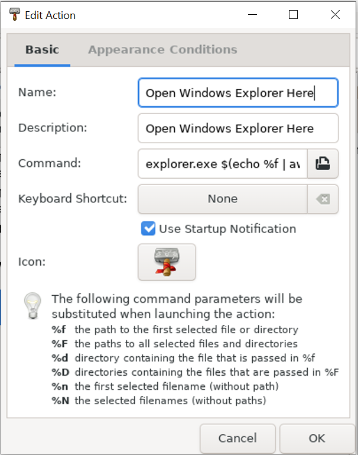
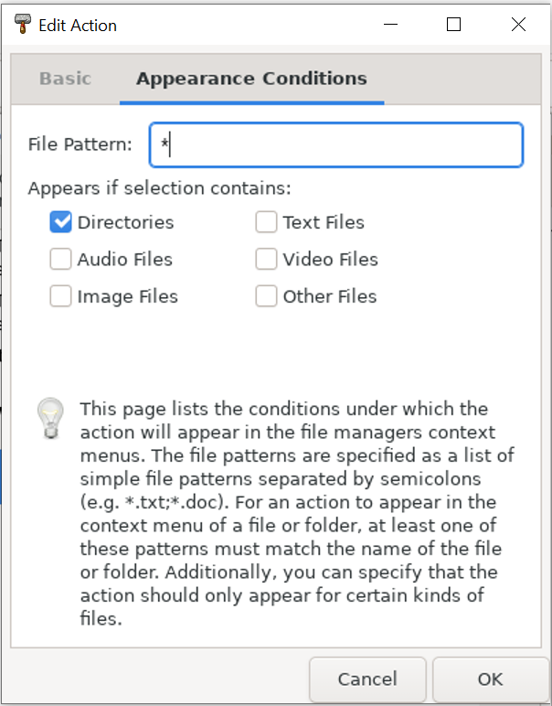
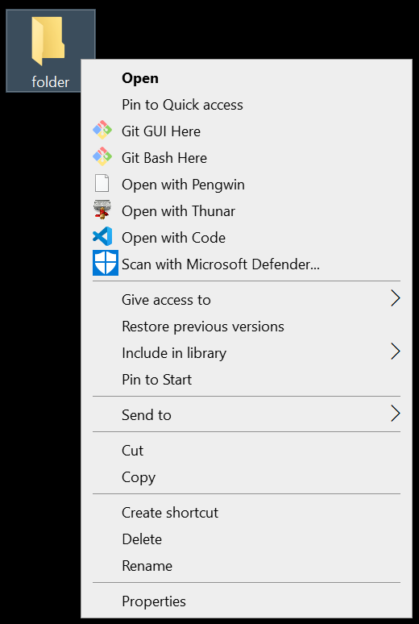

# Thunar

Thunar is a file manager for Linux and other Unix-like systems

# Install

> sudo apt install thunar thunar-archive-plugin thunar-media-tags-plugin

# Open a Folder with "Windows Explorer"

# by Right-clicking a Folder

1) Go to "Edit > Configure custom actions..."
2) Add a new custom action.
3) Enter the following settings:

[Basic] 

Name & Description: 
> Open Windows Explorer Here 

Command: 
> explorer.exe $(echo %f | awk -F '/' '{print $NF}') 

[Appearance Conditions] 

File Patther: 
> * 

Appears if selection contains: 
> Directories 

# by Right-clicking a File

1) Go to "Edit > Configure custom actions..."
2) Add a new custom action.
3) Enter the following settings:

[Basic] 

Name & Description: 
> Open Windows Explorer in Parent Directory 

Command: 
> explorer.exe . 

[Appearance Conditions] 

File Patther: 
> * 

Appears if selection contains: 
> Text Files, Audio Files, Video Files, Image Files, Other Files 

# Launch gnome-terminal via thunar

https://github.com/eliranwong/wsl2/blob/master/terminal/gnome-terminal.md#to-work-with-thunars-custom-actions

# Launch Thunar from Windows Context Menu

1) Press Windows key + R and run "regedit" to open Registry Editor.
2) Go to "Computer\HKEY_CLASSES_ROOT\Directory\Background\shell\"
3) Right-click "shell" and select "New > Key"
4) Name the newly created key as "Thunar"
5) Set the value of "(Default)" as "Open with Thunar"
6) <b>INSIDE</b> Thunar, right-click and select "New > String Value"
7) Name the newly created string as "Icon" and set the value as "C:\Users\elira\wslu\Thunar.ico"
update...

