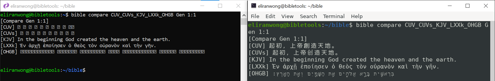

# Issues with pengwin terminal window 

Two terminal windows are compared with the following screenshot:

The one on the left is pengwin terminal, the one on the right is gnome-terminal.

You can see pengwin terminal does not display Chinese and Hebrew characters in unicode.

Though it is possible to change the font setting of pengwin terminal, we yet to find a single font that is able to display all languages.

# Alternatives

We tested the following terminal apps on WSL2.

gnome-terminal: https://github.com/eliranwong/wsl2/blob/master/terminal/gnome-terminal.md

rxvt-unicode: https://github.com/eliranwong/wsl2/blob/master/terminal/urxvt.md

Windows Terminal (Preview): https://github.com/eliranwong/wsl2/blob/master/terminal/windows_terminal.md

# Comment:

"gnome-terminal" is easier to be configured.  Copy & Paste in "gnome-terminal" can be done through right-click context menu or keyboard shortcuts.  We like "Tab" features of "gnome-terminal" too.

It looks like Windows Terminal is a good alternative.  However, it still have bugs to fix.  We found that some Linux commands do not work as expected.  For example, it is able to use "more" command, but navigation with keys "space", "b", or "q" do not work.
